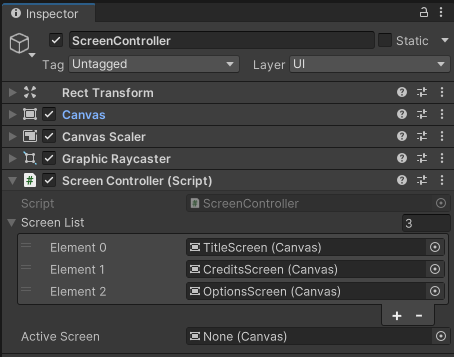

# Log 001 - Screen Controller

> Reference: [Implement data persistence between scenes](https://learn.unity.com/tutorial/implement-data-persistence-between-scenes#634f8281edbc2a65c86270c5)

One aspect of many games is the possibility to retain data throughout the gameplay. Changing levels, screens ans such shouldn't modify the player's data and should retain the already obtained data, therefore is a need in many games.

For this I've followed the above link to create a Screen Controller.

## What Will be Used

To achieve the desired results we'll be using the method `#!c# DontDestroyOnLoad()`, `Static classes` and `Class members`.

- `#!c# DontDestroyOnLoad()`: A method in Unity that marks a GameObject to be saved in memory even when loading or unloading a new scene.

- `Static classes` and `Class members`: Static class members can be accessed from anywhere without having to reference a specific object.

## Code Base

``` c# title="Base of the Code" linenums="1"
public class Controller : MonoBehaviour{

    public static Controller _instance; // (1)!

    private void Awake(){

        if(_instance != null){ // (2)!
            Destry(gameObject);
            return;
        }

        _instance = this; // (3)!
        DontDestroyOnLoad(gameObject);
    }

}
```

1. This is the variable that stores the first instance of the controller

2. Here is ensured that if another `Controller` is instantiate it will be deleted as only one is needed

3. Here is stored the first instance of the controller, marked with the method `#!c# DontDestroyOnLoad()`

??? tip "Singletons"
    The code pattern here is called **singleton**. This pattern is used to ensure what we told earlier, that only a **single intance** of the object can ever exist, so it acts as a global variable.
    
    > For more details: [Singleton - Refactoring Guru](https://refactoring.guru/pt-br/design-patterns/singleton)

## Screen Controller Points

Beyond the singleton pattern the following was implemented in the Screen Controller.

=== "One Single Canvas"
    In order to keep the project organized, I've used the singleton pattern to ensure that only one ScreenController existed.

    The **ScreenController**, in this project, is a component of a **Canvas** that is unique throughout the scenes.

    ???+ info "ScreenController's Canvas"
        <center>
        
        </center>

=== "List of Screens"
    ``` c# title="Screen Enum" linenums="1"
    enum SCREENS_ID {   Title = 0,
                        Credits,
                        Options }

    public Canvas[] _screenList;
    ```

    To be able to create more and more screens, without more effort than necessary, in the ScreenController I've created a enumered list of screens in creation order.

    Also, in the prefab, the created screens are stored in the list to be used later.

=== "Screen Stack"
    ``` c# title="Screen Stack Attributes" linenums="1"
    Stack<Canvas> _screenStack = new Stack<Canvas>();
    public Canvas _activeScreen;
    ```

    Using the concept of a stack, the game sceens are piled on top of each other depending of to keep the consistency from where the player came.

    For the exception of the TitleScreen, that is created on the Start.

    ??? info "Start Method"
        ``` c# title="Start() Method" linenums="1"
        public bool isTitle = true;

        private void Start() {
            if (isTitle) { // (1)!
                Canvas titleScreen = (Canvas)Instantiate(_screenList[(int)SCREENS_ID.Title]);
                AddScreenToStack(titleScreen);
            }
        }
        ```
        
        1. This validation is for testing on other scenes beyond the **TitleScene**

    Every other screen can be handled outside the **ScreenController** by calling the methods

    === "AddScreenToStack"
        ``` c# title="AddScreenToStack(Canvas screen)"
        public void AddScreenToStack(Canvas screen) {
            screen.transform.SetParent(transform, false); // (1)!
            _screenStack.Push(screen);
            UpdateActiveScreen();
        }
        ```

        1. We set all new screens as a child object of the **ScreenController**

    === "CloseCurrentScreen"
        ``` c# title="CloseCurrentScreen()"
        public void CloseCurrentScreen() {
            if(_screenStack.Count > 0) { // (1)!
                Canvas canvasToBeClosed = _screenStack.Peek();
                _screenStack.Pop();
                Destroy(canvasToBeClosed.gameObject);
                UpdateActiveScreen();
            }
        }
        ```

        1. Validate that we have a screen to remove to not cause an stack error

    === "UpdateActiveScreen"
        ``` c# title="UpdateActiveScreen()"
        public void UpdateActiveScreen() {
            if(_activeScreen != null) // (1)!
                _activeScreen.enabled = false;

            if(_screenStack.Count > 0 ) { // (2)!
                _activeScreen = _screenStack.Peek();
                _activeScreen.enabled = true;
            }
        }
        ```

        1. Validate that we have a screen to disable
   
        2. If we have screens, we go back and forth between then

``` c# title="ScreenController.cs" linenums="1"
using System.Collections;
using System.Collections.Generic;
using UnityEngine;
using UnityEngine.SceneManagement;

public class ScreenController : MonoBehaviour {

    private void Awake() {
        if (_instance != null)
        {
            Destroy(gameObject);
            return;
        }

        _instance = this;
        DontDestroyOnLoad(gameObject);

        SceneManager.sceneLoaded += this.OnSceneLoadedCallback;
    }


    void OnSceneLoadedCallback(Scene scene, LoadSceneMode mode) {
        CloseCurrentScreen();
        _activeScreen = null;
    }


}
```