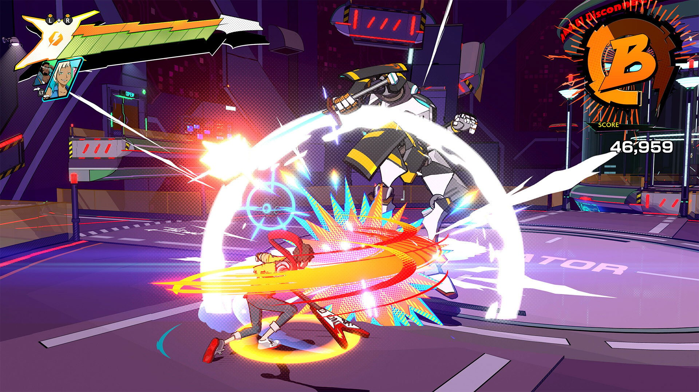

# Log 002 - Games Analysis
`Date: 08/08/2023 | 10/08/2023`

## Classic Rhythm Games

Here it'll be described some of the classic rhythm games. Those games use _note_ elements that the player should play to gain points and progress through the game.

??? info "Guitar Hero"
    

    Original console: Playstation 2

    Guitar Hero is a classic rhythm game focused in simulating the experience of playing rock band songs with a guitar, bass, drums, etc.

    The game itself is fairly simple and became more popular with it specific guitar controllers.

    The game screen have 5 lanes represented by the colors green, red, yellow, blue and orange. In those lanes circles would come down and the player should hit the note in the right spot of each lane based on the instruments notes, pressing the button corresping to the lane and flipping the switch of the guitar controller. Making this the basic mechanic of the game.

    Some notes could be long (single tap, maintaining the note pressed), normal(single tap on the note), hammered (only the note could be pressed, not needing to flip) or have multiple notes at the same time.

    Other features are the score, which increases on hits depending of the timing of the player to hit the notes. The rock meter, that would vary depending of the player's accuracy to play the notes, in case of miss the gauge would decrease and if it reached 0, the song would stop and the level failed.

    Another cool mechanic the the star power that would double the points awarded, this power would be enabled by some specific parts of the song if the player got all the sequence right,

    The game itself could have or not a story to tell, and with the pass of time the mechanics would become more refined and the game's repertoire would increase, adding different commands for different instruments, etc. But the core would stay the same.

    > For more details: [Guitar Hero Mechanics - NEOSEEKER](https://guitarhero.neoseeker.com/wiki/Game_Mechanics)

??? info "Deemo"
    

    Original console: Smartphones

    Deemo follows the same logic from Guitar Hero, with the core of the game based on the player following the rhythm of the music and playing the notes on the right time.

    Varying from Guitar Hero, Deemo focus more on the story of the game and on piano songs.

    Being built for smartphones, the player would have not only 5 buttons in the screen to play, but the hole line of the screen would be played, because the notes could come in different positions of the X axis.

    Similar to Guitar Hero there could be hold notes, or just tap notes, but the player don't have a score, and the player check its progress by how much percentage of the music it got (based of how well it timed the notes) and instead of failing a level, the player could continue playing even if it missed half of the music.

    > For more details: [Deemo Mechanincs - Deemo Fandom](https://deemo.fandom.com/wiki/Gameplay#Scoring)

??? info "osu!"
    

    Original console: Computer

    Osu! is inspirated in the games from the Nintedo DS games Osu! Tatakae! Ouendan!, Elite Beat Agents, etc.

    The game also features musics to be played by the player as guitar hero, failing if many notes are missed.

    The main aspect of it is the use of a whole screen to play the game using the mouse.

    The player should follow the notes by their numbers and colors, by clicking on them.

    There're two special actions that are slinding the note and spinning the wheel.

    > For more details: [Osu! Mechanics - Osu! Wiki](https://osu.ppy.sh/wiki/en/Game_mode#osu!)

??? info "Beat Saber"
    

    Orignal console: VR

    Continuing the concept of classic rhythm games we have the VR version.

    This games uses two controllers to simulate, obviously, sabers that are used to cut boxes that come to the player.

    There's two colors and two types of boxes, red and blue, dots and arrows.
    - Red and blue represents the color of the saber that need to cut the box; And
    - Dot represent that any direction can cut the box and then arrows indicates the direction that the saber should cut the box.

    > For more details: [Beat Saber Mechanics - Beat Saber Wiki](https://beatsaber.fandom.com/wiki/Gameplay)

## Alternative Rhythm Games

Alternative rhythm Games not only feature the rhythm as a core mechanic, but emphasize in other core mechanic also.

??? info "Geometry Dash"
    

    Original Console: Smartphones

    Geometry Dash uses the rhythm of musics to guide the player's actions through its levels.

    The only action the player has is to tap the screen. But the game implements different kinds of character models called "icons"([Icon Kit - Geometry Dash Wiki](https://geometry-dash.fandom.com/wiki/Icon_Kit#UFOs), contains all kinds of types of icons.) that change the way it interacts with the level.

    Some icons need the player to tap and hold, tap consecutively, etc.

    The goal of the game, is to complete the level avoiding the obstacles that causes instant kill.

    So the player can play the game without music, but the music is generally used to guide the player's taps, so it still counts as a rhythm game.

    > For more details: [Geometry Dash Wiki](https://geometry-dash.fandom.com/wiki/Transporters)

??? info "Crypt of the NecroDancer"

## Action Rythm Games

??? info "Hi-Fi Rush"
    

    Original console: PC and Xbox Series X/S

    This games fuses Hack'n Slash with Rythm, where the player "[slay enemies to the beat of the music](https://exputer.com/guides/hi-fi-rush-beginners-tips-tricks/)". Every player action syncs to the music and they are in control of it.

    Although the game allows the players to "button smash", the key to master the game is to time your ations to the beat for powerful attacks.

    > For more details:
    > <ul> [Get From Rookie to Rock Star With Our Hi-Fi Rush Beginner's Guide](https://bethesda.net/en/article/76iGyCZH5Ytt7zvm0JTjsv/hi-fi-rush-beginners-guide#:~:text=Hi%2DFi%20RUSH%20is%20a,tap%20into%20Chai%27s%20true%20power.) </ul>
    > <ul> [Hi-Fi Rush: Beginner's Guide [Tips & Tricks]](https://exputer.com/guides/hi-fi-rush-beginners-tips-tricks/) </ul>

??? info "Sword of Symphony"
    

    Original console: PC

    This is a game still in development that uses that plays with the music theory in order to give a new experience to the player.

    Watching the development summaries, is possible to notice that the game uses a neutral, but continuous, background music to mix perfectly with the enemies' and player's actions to compose a beatyfull music.

    Button smashing is not an option as it weakens the player's damage.

    > For more details: [Sword of Symphony linktr.ee](https://linktr.ee/swordofsymphony)

??? info "Metal Hellsinger"
    

    Original console: PC, PS4, Xbox One and Xbox Series X/S

    Mixing FPS and Metal, the creators of the game mixed the mechanics of classical rythm games and the action of first person shooter.

    The game has in its center an aim like classical shooters, but also a series of incomming "arrows" that shows the beat to the player. If the attacks (shooting, slashing, etc.) are done when those hit the center, the player receive more bonuses.

    > For more details: [Metal Hellsinger Tutorials - Fandom](https://metal-hellsinger.fandom.com/wiki/Tutorials)

??? info "BPM: Bullets Per Minute"
    

    Original console: PC, PS4, Xbox One and Nintendo Switch

    Similar to Metal Hellsinger, the game also mixes the mechanics of classical rythm games and the action of first person shooter.

    The game itself also take use of the music to make the enemies do actions to the beat, increasing the dynamic of rythm.

    > For more details: [Bullets Per Minute Wiki - Mechanics](https://bulletsperminute.wiki/view/Mechanics)